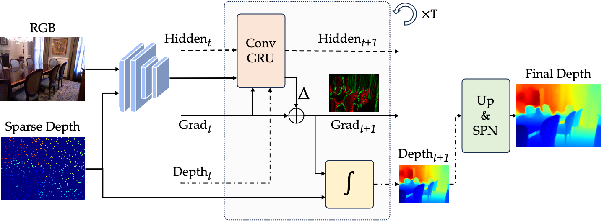

<p align="center">

  <h1 align="center">(ECCV24) OGNI-DC: Robust Depth Completion with Optimization-Guided Neural Iterations</h1>
  <p align="center">
    <a href="https://zuoym15.github.io/"><strong>Yiming Zuo</strong></a>
    ·
    <a href="https://www.cs.princeton.edu/~jiadeng/"><strong>Jia Deng</strong></a>    
  </p>
  <p align="center">
    <a href="https://pvl.cs.princeton.edu/">Princeton Vision & Learning Lab (PVL)</a>    
  </p>
</p>

<h3 align="center"><a href="https://arxiv.org/abs/2406.11711">Paper</a> </a></h3>

<p align="center">
  <a href="https://arxiv.org/abs/2406.11711">
    
  </a>
</p>


## Environment Setup
We recommend creating a python enviroment with anaconda.
```shell
conda create -n OGNIDC python=3.8
conda activate OGNIDC
# For CUDA Version == 11.3
conda install pytorch==1.10.1 torchvision==0.11.2 torchaudio==0.10.1 cudatoolkit=11.3 -c pytorch -c conda-forge
pip install mmcv==1.4.4 -f https://download.openmmlab.com/mmcv/dist/cu113/torch1.10/index.html 
pip install mmsegmentation==0.22.1 
pip install timm tqdm thop tensorboardX tensorboard opencv-python ipdb h5py ipython Pillow==9.5.0 plyfile einops
```

#### NVIDIA Apex

We used NVIDIA Apex for multi-GPU training. Apex can be installed as follows:

```shell
git clone https://github.com/NVIDIA/apex
cd apex
git reset --hard 4ef930c1c884fdca5f472ab2ce7cb9b505d26c1a
conda install cudatoolkit-dev=11.3 -c conda-forge
pip install -v --no-cache-dir --global-option="--cpp_ext" --global-option="--cuda_ext" ./ 
```

You may face the bug `ImportError: cannot import name 'container_abcs' from 'torch._six'`. In this case, change line 14 of apex/apex/_amp_state.py to `import collections.abc as container_abcs` and re-install apex.

#### (Optional) Deformable Convolution V2 (DCNv2)

(Needed only if you use NLSPN) Build and install DCN module.

```shell
cd src/model/deformconv
sh make.sh
```

## Datasets

Create a folder named `datasets` and put all datasets under it.

#### 

#### NYUv2

We used preprocessed NYUv2 HDF5 dataset provided by [Fangchang Ma](https://github.com/fangchangma/sparse-to-dense).

```shell
cd datasets
wget http://datasets.lids.mit.edu/sparse-to-dense/data/nyudepthv2.tar.gz
tar -xvf nyudepthv2.tar.gz
```

After that, you will get a data structure as follows:

```
nyudepthv2_h5
├── train
│    ├── basement_0001a
│   ...   ├── 00001.h5
│         └── ...
└── val
    └── official
          ├── 00001.h5
          └── ...
```

#### KITTI

Download the following files and unzip under the `kitti_depth` folder:

[data_depth_annotated](https://s3.eu-central-1.amazonaws.com/avg-kitti/data_depth_annotated.zip), 
[data_depth_velodyne](https://s3.eu-central-1.amazonaws.com/avg-kitti/data_depth_velodyne.zip), 
[data_depth_selection](https://s3.eu-central-1.amazonaws.com/avg-kitti/data_depth_selection.zip)

Finally, download kitti raw images by:

```
cd datasets/kitti_depth
wget https://github.com/youmi-zym/CompletionFormer/files/12575038/kitti_archives_to_download.txt
wget -i kitti_archives_to_download.txt -P kitti_raw/
cd kitti_raw
unzip "*.zip"
```

The overall data directory is structured as follows:

```
kitti_depth
├──data_depth_annotated
|     ├── train
|     └── val
├── data_depth_velodyne
|     ├── train
|     └── val
├── data_depth_selection
|     ├── test_depth_completion_anonymous
|     |── test_depth_prediction_anonymous
|     └── val_selection_cropped
└── kitti_raw
      ├── 2011_09_26
      ├── 2011_09_28
      ├── 2011_09_29
      ├── 2011_09_30
      └── 2011_10_03
```

#### VOID 
First download the zip files (you can use [gdown](https://github.com/wkentaro/gdown)) under `datasets`:
```
cd datasets
https://drive.google.com/open?id=1kZ6ALxCzhQP8Tq1enMyNhjclVNzG8ODA
https://drive.google.com/open?id=1ys5EwYK6i8yvLcln6Av6GwxOhMGb068m
https://drive.google.com/open?id=1bTM5eh9wQ4U8p2ANOGbhZqTvDOddFnlI
```
Under the `datasets` folder, run
```
sh ../unzip_void.sh
```
Finally, the file structure should be:
```
void_release
    ├── void_150
    │    ├── data
    │    │     ├── birthplace_of_internet
    │    │     └── ...
    │    ├── test_absolute_pose.txt      
    │    └── ...
    ├── void_500
    │    └── ...
    └── void_1500
         └── ...
```

#### DDAD

We use the dataset pre-processed by the [VPP4DC](https://github.com/bartn8/vppdc) authors.
You can download from:
```
https://drive.google.com/open?id=1y8Rt3Hld8zVTSKxx9d9yYXSzr5niKN7i
```
Unzip it and get the file structure:
```
void_release
    └── pregenerated
            └── val
                ├── gt
                ├── hints
                ├── intrinsics
                └── rgb          
```

## Reproduce Results in the Paper 
Download checkpoints from 
```
https://drive.google.com/drive/folders/1LWrb1uFcJ5SGJdS8a9aqeyzkRMYyECRt?usp=sharing
```
and puts them under the `checkpoints` folder.

#### Testing
```
cd src

# NYU in-domain (500 points)
sh testing_scripts/test_nyu.sh 

# NYUv2 sparsity level generalization (5~20,000 points)
sh testing_scripts/test_nyu_sparse_inputs.sh 

# KITTI sparsity level generalization (8~64 lines)
sh testing_scripts/test_kitti_sparse_inputs.sh

# Zero-shot test on VOID
sh testing_scripts/test_void.sh

# Zero-shot test on DDAD
sh testing_scripts/test_ddad.sh

# Example command for generating KITTI online server submission file
sh testing_scripts/test_kitti_server_submit.sh
```

## Training from Scratch 

#### Resource requirements
Training on NYU requires 1x24GB GPU (e.g., RTX 3090) and ~3 days.
Training on KITTI requires 8x48GB GPUs (e.g., RTX A6000) and ~7 days.

#### Training
```
cd src

# NYU
sh training_scripts/train_nyu_generalizable.sh 

# KITTI
sh training_scripts/train_kitti_generalizable.sh 

# NYU best in-domain performance
sh training_scripts/train_nyu_best_performance.sh 

# KITTI online server (L1)
sh training_scripts/train_kitti_best_performance_l1.sh 

# KITTI online server (L1+L2)
sh training_scripts/train_kitti_best_performance_l1+l2.sh 
```

## Acknowledgement
This codebase is developed based on [CompletionFormer](https://github.com/youmi-zym/CompletionFormer) by Youmin Zhang et al. We thank the authors for making their code public.

## Citation
If you find our work helpful please consider citing our paper:
```
@article{zuo2024ogni,
  title={OGNI-DC: Robust Depth Completion with Optimization-Guided Neural Iterations},
  author={Zuo, Yiming and Deng, Jia},
  journal={arXiv preprint arXiv:2406.11711},
  year={2024}
}
```


